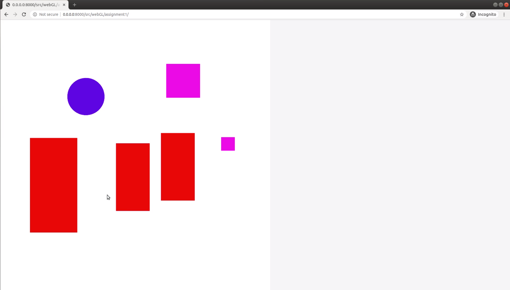
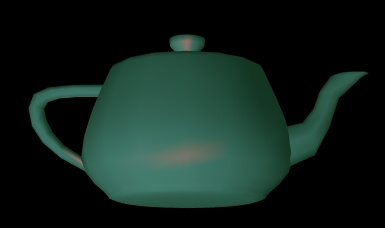

# Computer Graphics Using WebGL
This repository is a compilation of Assignments that I have attempted for my Computer Graphics course. It consists of basic 2D and 3D rendering including object tranformations, picking, camera and lighting setup in WebGL. The following are a few snapshots of the rendering produced for the assignment.

## Run The Code
The repository code can be run by cloning the repository and running the command <code>python -m http.server</code> inside the folder. Then open http://0.0.0.0:8000/ on the browser (chrome/firefox).

## Reports
The reports present in the ./src/webGL/reports folder provides a detailed description of the implementation.

## Assignment Snapshots
<ul>
<li>
The application screen for assignment 1 is as follows:
 

</li>

The application screen for assignment 3 is as follows:
 

</li>

<li>
The following is a teapot rendered using Gouraud and Phong shaders respectvely:

</li>

<li>
The following is the effect of distance from light on specular lighting:

</li>

<li>
The following images depict the effect of distance attenuation term on lighting:

</li>

<li>
The following image depicts rotation using quaternions.

</li>
</ul>
